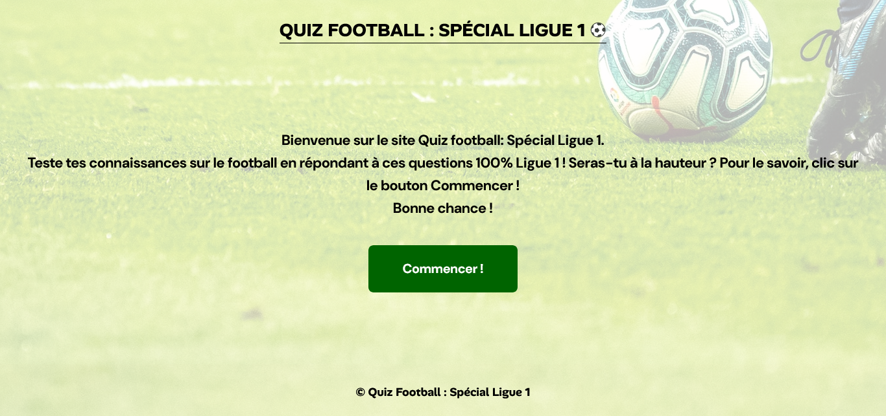
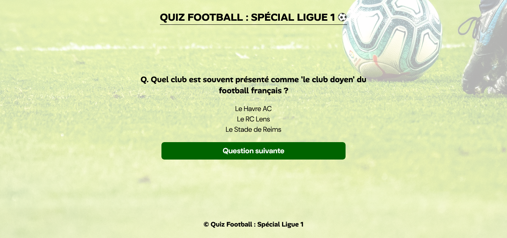

## QUIZ FOOTBALL : SPECIAL LIGUE 1 ⚽

## Le challenge

Ce site propose un quiz de 20 questions portant sur le championnat de France de football, son histoire, ses grands clubs et ses joueurs ayant fait sa renommée.

Cliquez sur le bouton commencer pour débuter le quiz. Bonne chance !

Ce site a été réalisé en HTML5, CSS3 et JavaScript. Il s'adapte au différentes résolutions d'écran desktop, tablette et mobile.

## Démonstration

Lien vers le projet :

## Projet développé avec

- Utilisation des balises sémantiques HTML5
- CSS3
- Flexbox
- Position absolute
- Position relative
- Animation css
- Desktop first
- Utilisation d'un normaliseur : le fichier normalize.css
- Importation des polices "DM Sans" et "Alan Sans"
- JavaScript
- Code JavaScript commenté
